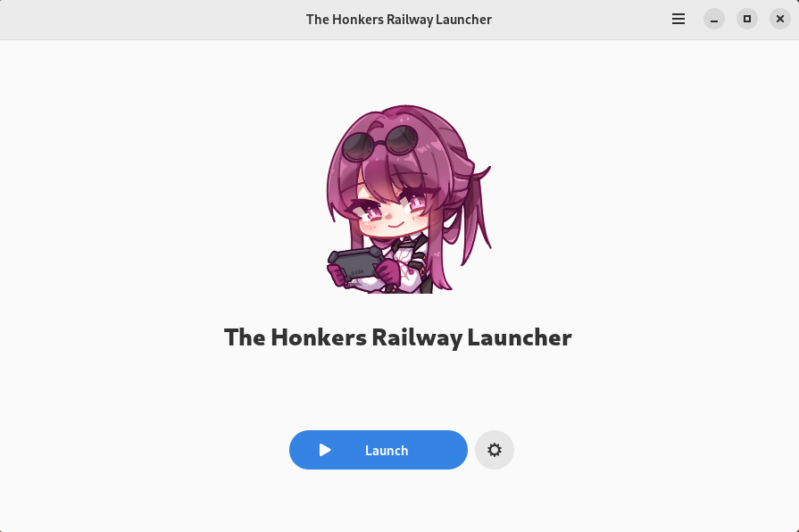
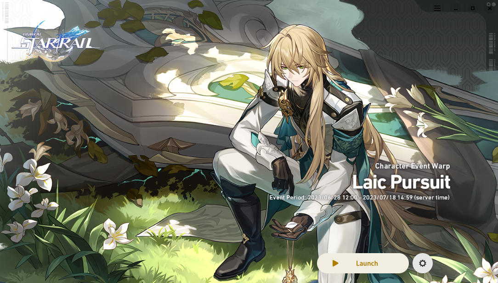
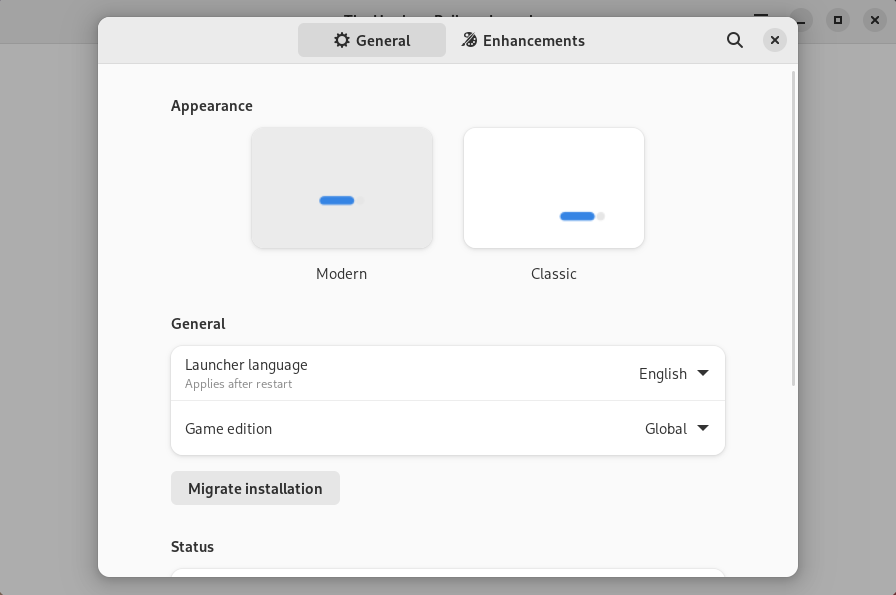
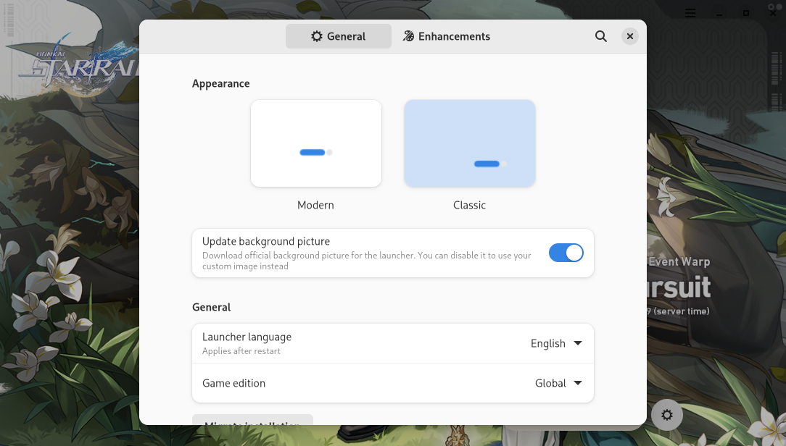

| Modern style | Classic style |
| :-: | :-: |
| <picture><source media="(prefers-color-scheme: dark)" srcset="repository/main-modern-dark.png"></picture> | <picture><source media="(prefers-color-scheme: dark)" srcset="repository/main-classic-dark.png"></picture> |
| <picture><source media="(prefers-color-scheme: dark)" srcset="repository/settings-modern-dark.png"></picture> | <picture><source media="(prefers-color-scheme: dark)" srcset="repository/settings-classic-dark.png"></picture> |

    <a href="https://discord.gg/ck37X6UWBp">Discord</a> ·
    <a href="https://github.com/an-anime-team/the-honkers-railway-launcher/wiki">Wiki</a>

 

# ⚠️ Please don't link to this repository

We understand you want to help people run An Anime Game on Linux. The issue is, the more people know
of the tools involved in it, the higher the chances The Anime Game Company will notice them, and then
fix the flaws that let us do the needful.

While sharing in your self-managed chat services and through private messaging is fine, we humbly ask
that you refrain from publically sharing links to this repository, or to any of the tools involved.

Or share them and ruin it for the dozens of Linux players. It's up to you.

## If you're going to share it anyway

Do what you must, but we would respectfully request that you try to label the game as "The Honkers Railway Game"
instead of the actual name of the game, to avoid search engine parsing.

 

# ♥️ Useful links and thanks

* Original patch project without which this project wouldn't be possible. Link is omitted for "privacy" purposes
* [macOS launcher](https://github.com/3Shain/yet-another-anime-game-launcher) which contains some additional compatibility components
* [Wiki](https://github.com/an-anime-team/the-honkers-railway-launcher/wiki) contains some basic FAQ, installation instructions and more
* [Releases page](https://github.com/an-anime-team/the-honkers-railway-launcher/releases) where you can find latest available version
* [Changelog](CHANGELOG.md) with chronology of the project

All the project's life happen in our discord server. If you have any questions or want to report an issue - please contact the dev directly there.

 

# ⬇️ Download

Launcher developer does not provide any packages for this programm. Instead, we almost fully rely on other people to maintain them.

To see the installation guides, please visit [this wiki page](https://github.com/an-anime-team/the-honkers-railway-launcher/wiki/Installation).

Instructions may be outdated due to lack of interest in maintaining them. You can help the project by keeping documentation up to date if you're interested in it.

## 😀 Official support

These packages are officially supported by the An Anime Team, and we try to ensure that they work for everyone.

| Format | Wiki | Source | Distributions | Maintainer |
| - | - | - | - | - |
| Flatpak | [wiki](https://github.com/an-anime-team/the-honkers-railway-launcher/wiki/Installation#-any-distribution-flatpak) | [flatpak-builds](https://github.com/an-anime-team/flatpak-builds/tree/honkers-railway) | Any (Fedora, Pop!_OS, SteamOS / Steam Deck, etc.) | Luna (available in discord) |
| RPM | [wiki](https://github.com/an-anime-team/the-honkers-railway-launcher/wiki/Installation#-fedora-rpm) | [THRL](https://build.opensuse.org/repositories/home:Maroxy:AAT-Apps/HRL) * | Fedora, OpenSUSE | Maroxy (second discord admin) |

> [!NOTE]
> RPM packages are often really outdated. It's not recommended to use them.

## 🙂 Community support

These packages are supported by active members of our community. They're widely used and we keep some level of interactions with their maintainers.

| Format | Wiki | Source | Distributions | Maintainer |
| - | - | - | - | - |
| AUR | [wiki](https://github.com/an-anime-team/the-honkers-railway-launcher/wiki/Installation#-arch-linux-aur) | [the-honkers-railway-launcher-bin](https://aur.archlinux.org/packages/the-honkers-railway-launcher-bin) | Arch Linux, Manjaro, EndeavourOS | xstra * |
| NixOS module | [wiki](https://github.com/an-anime-team/the-honkers-railway-launcher/wiki/Installation#-nixos-nixpkg) | [aagl-gtk-on-nix](https://github.com/ezKEa/aagl-gtk-on-nix) | NixOS | Luxxy * |
| Ebuild | [wiki](https://github.com/an-anime-team/an-anime-game-launcher/wiki/Installation#gentoo) | [aagl-ebuilds](https://github.com/an-anime-team/gentoo-ebuilds) | Gentoo | johnthecoolingfan * |

> [!NOTE]
> Honorary members of our discord server. We have direct contact with them.

## 😑 Third party support

These packages are supported by third party distributors. They either did not contact us, or contact exceptionally rarely. We do not verify state of these packages, and we are not related to their state at all.

| Format | Source | Distributions |
| - | - | - |
| DEB | [the-honkers-railway-launcher](https://launchpad.net/~thundergemios10/+archive/ubuntu/the-honkers-railway-launcher) | Ubuntu, Linux Mint, Pop!_OS |
| Pacstall | [the-honkers-railway-launcher-bin](https://pacstall.dev/packages/the-honkers-railway-launcher-bin) | Ubuntu |

## Chinese version support

This should be automatically enabled if you're using `zh_cn` (Chinese) as your system language. If you're not using it - you can change the game edition in the launcher settings.

The main problem, though, is that github is blocked in China, and it's used in other parts of the launcher - not just in game edition. Notably, you can't use the same components index as other people do.

To fix this, you have to make your own copy of the [components](https://github.com/an-anime-team/components) repository and change all the links there from github releases to some mirror. Later you can update the components index repo link in your launcher's `config.json` file.

If you have any questions - feel free to contact the dev in our discord server (or if you have no way to use discord - try sending me an email, but it's unlikely to be received).

 

# 🚧 Project status

This project is in maintenance mode and is considered feature complete. It will continue to receive updates with bugfixes and support for new versions of the game. The various contributors help keep this project alive by keeping it up to date with latest game changes. I'm working on other projects, and the future is in uniting all the launchers in one single [universal launcher](https://github.com/an-anime-team/anime-games-launcher). This project stays in "proof of concept" stage right now and requires major changes, which, again, require interest from my side. Keep your eye on our discord server for more details.
